# TvMaze App

**TvMaze App** is an Android App made to search your favorite shows. 
You can:
- Find a main list of shows
- Search for a specific show
- Get info about the show, like:
    - Genres
    - Day and time that is in the air
    - Summary
    - Seasons and episodes
- Summary about a specific show

## Installation

- Open your Android Studio and:
    - If you have a project already opened, click in File -> New -> Project from Version Control..
    
    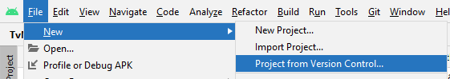
  
    - If you don´t have a project opened, click on the following button:
    
    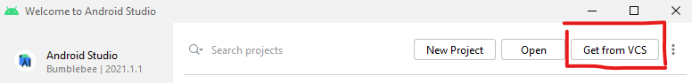
  
- You will see something like this:

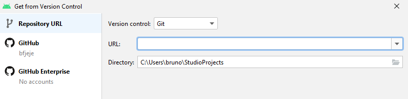

- Fill the *URL* field with this URL: <https://github.com/bfjeje/TvMazeApp.git>
- Select in which folder you want to download the project, using the *Directory* field.
- Click the *Clone* button to start downloading the project in the selected directory.
- You will be asked if you want to open it in this window, or in a new one. Any choice is good here.
- Once it´s downloaded, it will open the project, and you just have to wait a little bit, because
  Android Studio will do some background tasks. You will see this bar on the bottom of the screen:

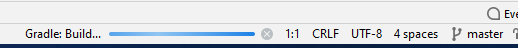
  
- After it disappears, you will see a folder tree like this:

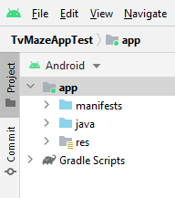

- Here you have two options: Run the code on a physical device, or in an emulator.
    - If you need information on how to use a physical device, follow the instructions in this link: <https://developer.android.com/studio/run/device>
    - If you need assistance configuring an emulator, use this link: <https://developer.android.com/studio/run/emulator>
- Then, you have to click on the *Run* button, on the upper center part of the screen.

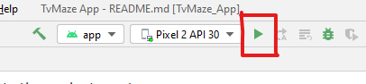

That´s it! Just wait until the installation is done 😃

## Usage

- You will see a list of shows on the main screen.
- You can search for a specific show using the top right search button, and writing the name of a show.

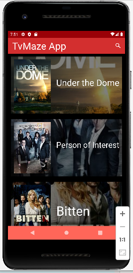

- if you search for a show, you will see a new list of series, based on the results of your search

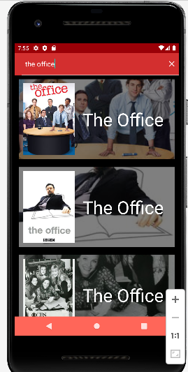

- After you click on a show, you will see some information about that show.

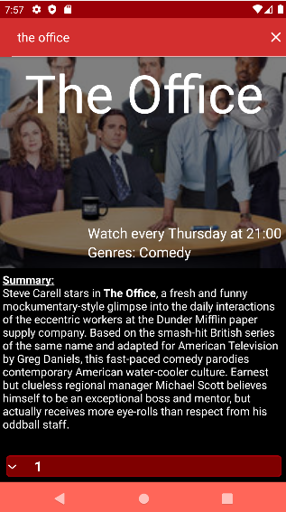

- You can click on a Season number, and you will see a list of episodes of that season.

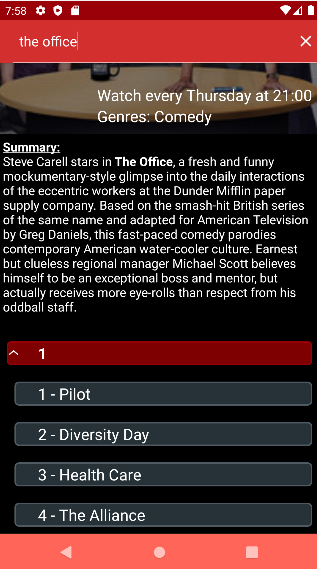

- And finally, if you click on an episode, you will see some more info about that episode

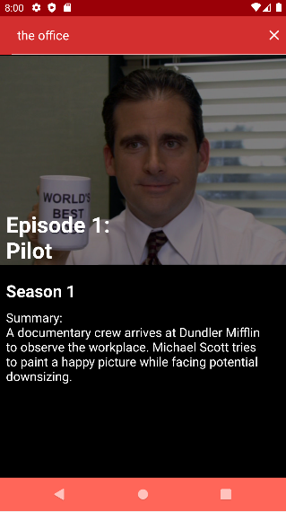

## Contributing

Pull requests are welcome. For major changes, please open an issue first to discuss what you would like to change.

Please make sure to update tests as appropriate.

## What I learned from this project

- Learned to use [Retrofit](https://square.github.io/retrofit/) from scratch (I worked in projects
  where Retrofit was already there)
- Learned to use
  the [Paging3](https://developer.android.com/topic/libraries/architecture/paging/v3-overview)
  library from scratch, and together with retrofit (Never used this library)
- Learned to use [Glide](https://github.com/bumptech/glide) to download images
- Learned a little bit more about [MVVM Architecture](https://developer.android.com/jetpack/guide)
  and [LiveData](https://developer.android.com/topic/libraries/architecture/livedata)
- Learned a little bit more about [Navigation](https://developer.android.com/guide/navigation)
- And finally learned to
  use [SearchView](https://developer.android.com/guide/topics/search/search-dialog)

## License
[MIT License](LICENSE)
